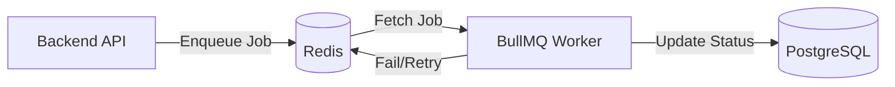

# Dezprox Hiring Platform - Queue Architecture

This document describes the BullMQ queueing system and worker management.

## Architecture

We use **BullMQ** with **Redis** as the message broker for background tasks.

## Configured Queues

### 1. `ai-evaluation`
- **Purpose**: Processes candidate coding submissions using OpenAI to generate feedback and scores.
- **Job Payload**: `{ candidateId: string, force: boolean }`
- **Retry Strategy**: 
  - Attempts: 3
  - Backoff: Exponential (starting at 5 seconds)
- **Concurrency**: Managed by the worker instance.

### 2. `assessment-timers` (Implicit via TimerProcessor)
- **Purpose**: Handles assessment timeouts and autosave triggers.

## Reliability Features

### 1. Redis Reconnection
The `RedisService` and BullMQ are configured with exponential backoff for Redis reconnections. If Redis goes down, workers will wait and reconnect once it's available without losing jobs (if `appendonly` is enabled in Redis).

### 2. Idempotency
Jobs are enqueued with a deterministic `jobId` (e.g., `ai-eval-${candidateId}`). This prevents duplicate jobs from being active for the same candidate simultaneously.

### 3. Error Handling
- Failed jobs are automatically retried based on the backoff policy.
- After all attempts fail, the job is moved to the "Failed" state.
- Errors are logged to the console and reported to Sentry.

## Scaling Recommendations

1.  **Separate Worker Process**: In production, run the `worker` service in its own container (as defined in `docker-compose.yml`).
2.  **Multiple Workers**: You can scale the `worker` service horizontally (`docker-compose up --scale worker=3`) to handle higher job throughput.
3.  **Redis Memory**: Monitor Redis memory usage. BullMQ can store many completed/failed jobs if not cleared. We use `removeOnComplete: true` to save space.
4.  **Priority Queuing**: For critical tasks (like password reset emails), consider using BullMQ's priority feature.
