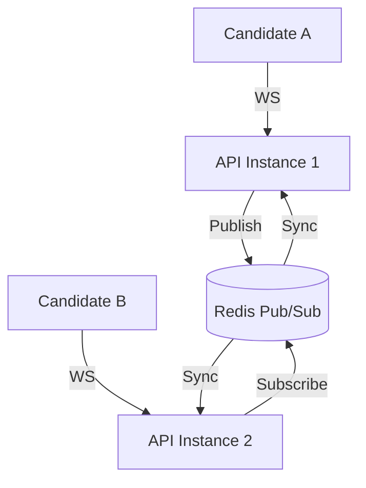

# Dezprox Hiring Platform - Real-time Architecture

This document describes the WebSocket architecture using Socket.IO.

## Architecture

We use **Socket.IO** with a **Redis Adapter** for real-time communication.



## Namespace: `/assessment`

All real-time interaction for assessments happens under the `/assessment` namespace.

### Authentication
- **Guard**: `WsJwtGuard`
- **Method**: JWT Bearer Token passed in the `auth` object during connection.
- **Enforcement**: Connections without a valid token are rejected.

### Rooms
1.  **Assessment Room (`assessmentId`)**: Used to broadcast updates related to a specific assessment (e.g., timer sync, group alerts).
2.  **Candidate Room (`candidate:${candidateId}`)**: Used to send targeted messages to a specific candidate (e.g., individual warnings, forced submission).
3.  **Role Rooms (`role:HR`, `role:ADMIN`)**: Used for administrative monitoring.

### Key Events

#### Client to Server
- `assessment:join`: Join the assessment room and start the timer session.
- `coding:autosave`: Periodically save coding progress.
- `assessment:heartbeat`: Keep-alive and status check.

#### Server to Client
- `timer:sync`: Synchronize the countdown timer across tabs/devices.
- `assessment:ended`: Notify the client that time has expired.
- `proctor:alert`: Anti-cheat alerts (tab switching, copy-paste).

## Reliability & Scaling

1.  **Redis Adapter**: Essential for multi-instance deployments. It ensures that an event emitted on Instance 1 reaches a client connected to Instance 2.
2.  **Sticky Sessions**: Not strictly required since we use the Redis adapter, but recommended for better performance.
3.  **Automatic Reconnection**: The frontend client is configured with:
    ```javascript
    reconnection: true,
    reconnectionAttempts: 5,
    reconnectionDelay: 1000,
    ```
4.  **Heartbeats**: Socket.IO's built-in heartbeat mechanism detects stale connections.

## Security

1.  **CORS**: Restricted to the `FRONTEND_URL`.
2.  **Authorization**: Users can only join rooms for assessments they are authorized to access (checked in `handleJoin`).
3.  **Validation**: All incoming data is validated using NestJS pipes.
