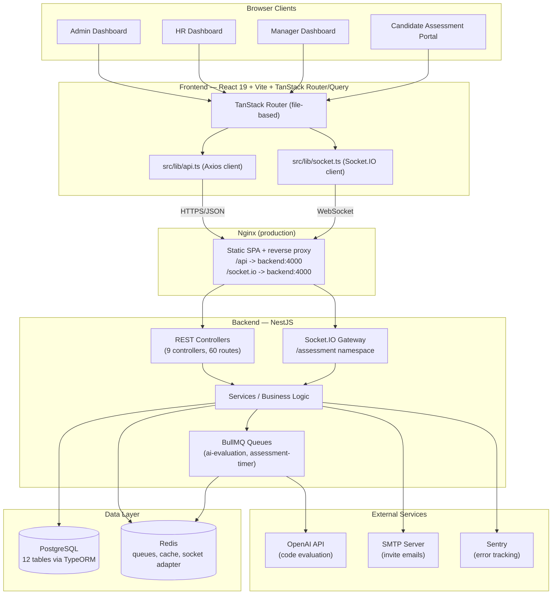

# 01 — Project Overview

## What Is This Project

**Dezprox Hiring Platform** is an internal recruitment and technical-assessment system built for Dezprox's own hiring pipeline. It is **not** a public-facing Applicant Tracking System (ATS) and it is **not** meant to be sold or exposed to the general internet as a product — it is an internal tool used by Dezprox staff (Admin, HR, Manager) to move candidates through a structured technical evaluation, and by candidates (invited only, no self-registration) to take that evaluation.

The platform combines three things that are normally separate tools:

1. A **candidate pipeline tracker** (like a lightweight ATS) — invite, status, notes.
2. A **live technical assessment engine** — a timed, three-round, server-authoritative test (MCQ → Typing → Coding) that a candidate takes in the browser.
3. An **AI-assisted evaluation and reporting layer** — OpenAI-based code review, aggregate analytics, and a shortlist/feedback workflow for hiring managers.

## Why It Exists

Dezprox needed a way to standardize technical hiring instead of running ad hoc take-home tests over email and spreadsheets. The goals that shaped the architecture:

- **Consistency** — every candidate for a given role sees the same round structure and time limits, scored the same way.
- **Signal, not vibes** — combine an objective score (MCQ correctness, typing speed/accuracy) with a subjective one (manager code review) and an AI-generated second opinion, rather than relying on a single interviewer's impression.
- **Auditability** — every round, submission, and score is stored server-side with timestamps, so HR/Admin can see exactly what happened.
- **Role separation** — Admin (platform owner), HR (pipeline movement, invites), Manager (technical review, scoring), and Candidate (assessment taker) each get a purpose-built dashboard instead of one generic screen with hidden permissions.

## Business Goals

| Goal | How the platform addresses it |
|---|---|
| Reduce time-to-hire for technical roles | Self-serve candidate assessment removes scheduling friction for round 1 screening |
| Reduce reviewer workload | AI evaluation pre-analyzes coding submissions before a human manager reviews them |
| Standardize evaluation criteria | Server-side scoring for MCQ/typing; structured feedback forms for manager review |
| Give leadership visibility into the funnel | Analytics dashboards (pass/fail ratio, hiring trends, leaderboard, topic breakdown) |
| Keep hiring data internal and auditable | Self-hosted stack (Postgres + Redis + NestJS), no third-party ATS SaaS dependency (aside from OpenAI for AI evaluation and SMTP for email) |

## Target Users

| Role | Who they are | What they do in the platform |
|---|---|---|
| **Admin** | Platform owner / senior leadership | Full access: manages candidates, question bank, reports, analytics, (intended) staff/settings administration |
| **HR** | Recruiting coordinators | Invites candidates, manages pipeline status (kanban), views candidate list and reports |
| **Manager** | Hiring managers / senior engineers | Reviews coding submissions, scores candidates, writes feedback, views analytics relevant to their review queue |
| **Candidate** | Job applicants (invite-only, no self-signup) | Logs in with an emailed temporary password, takes the 3-round assessment, views their own results once released |

## Current MVP Scope

As implemented today (see [`11_CURRENT_STATUS.md`](./11_CURRENT_STATUS.md) for exact completion percentages), the MVP covers:

- **Authentication** — JWT login/logout/refresh, RBAC by role (90% complete, no forgot-password)
- **Candidate Management** — CRUD, invite email, status pipeline, soft delete (80% complete)
- **Assessment Builder** — UI shell only, not wired to a backend (15% complete)
- **Question Bank** — MCQ + Coding question CRUD with CSV import, but **disconnected from the live assessment engine** (55% complete — see the critical architecture gap below)
- **3-round Assessment Engine** — MCQ, Typing, Coding, with server-side timers, Socket.IO realtime updates, anti-cheat visibility/blur detection (engine ~30–45% functional end-to-end due to two frontend API-client bugs and the Question Bank disconnect)
- **Reports** — score aggregation, shortlist toggle, result release, manager feedback (75% complete)
- **Analytics** — 8 cached dashboard/chart endpoints; Admin/HR wired, Manager page is a stub (55% complete)
- **AI Evaluation** — OpenAI-based code review via BullMQ queue, most production-ready module in the backend, but currently has nothing to evaluate in the live flow because of the assessment-provisioning gap (40% complete)
- **Settings** — UI shells only, no backend module exists (10% complete)
- **Notifications** — WebSocket events exist; one transactional email (invite); no in-app notification center (20% complete)

> **The single most important fact about the current MVP:** a candidate cannot complete an assessment end-to-end today. See [`13_KNOWN_ISSUES.md`](./13_KNOWN_ISSUES.md) Bug #01–#04 and [`16_HANDOVER_GUIDE.md`](./16_HANDOVER_GUIDE.md) for the exact fix path. This is the top priority for whoever picks up this codebase next.

## Future Roadmap (Summary)

See [`12_ROADMAP.md`](./12_ROADMAP.md) for the full sprint breakdown. In short:

1. **Sprint 1 (Critical):** unblock the core assessment flow — assessment provisioning, Question Bank bridge, missing frontend API methods, two crash bugs.
2. **Sprint 2:** complete the assessment experience — typing passages in DB, multi-select questions, code execution sandbox (or formally scope it out), report lookup fix.
3. **Sprint 3:** Admin/HR/Manager completeness — staff management API, Assessment Builder persistence, Manager Analytics page, dead button wiring.
4. **Sprint 4:** hardening — forgot-password, httpOnly refresh tokens, stricter login throttling, working ESLint config, notification center.

## Architecture Diagram

## Related Documents

- Feature-by-feature detail: [`02_FEATURES.md`](./02_FEATURES.md)
- Full architecture with diagrams: [`03_SYSTEM_ARCHITECTURE.md`](./03_SYSTEM_ARCHITECTURE.md)
- Current implementation status: [`11_CURRENT_STATUS.md`](./11_CURRENT_STATUS.md)
- **Start here if you're the new developer:** [`16_HANDOVER_GUIDE.md`](./16_HANDOVER_GUIDE.md)
