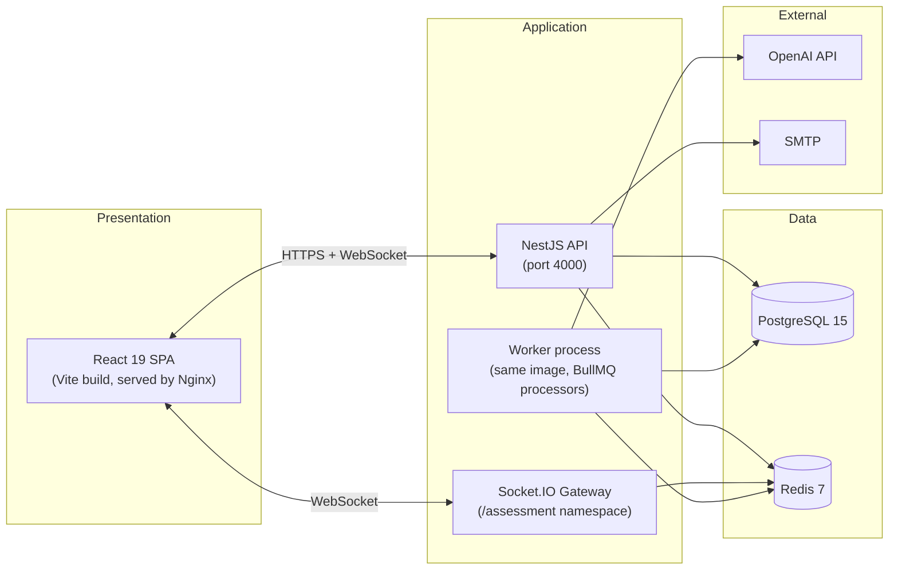
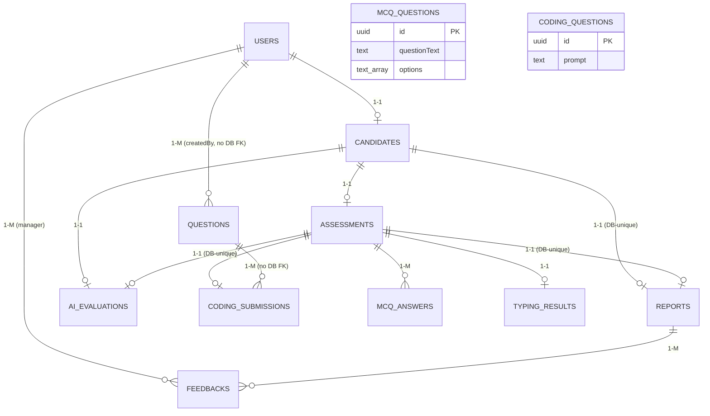
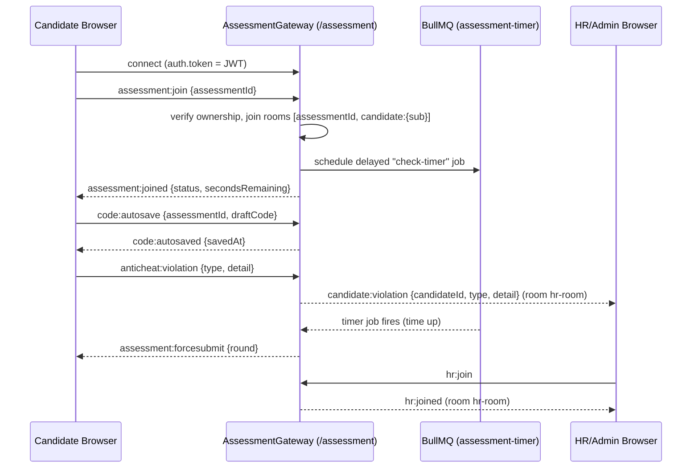
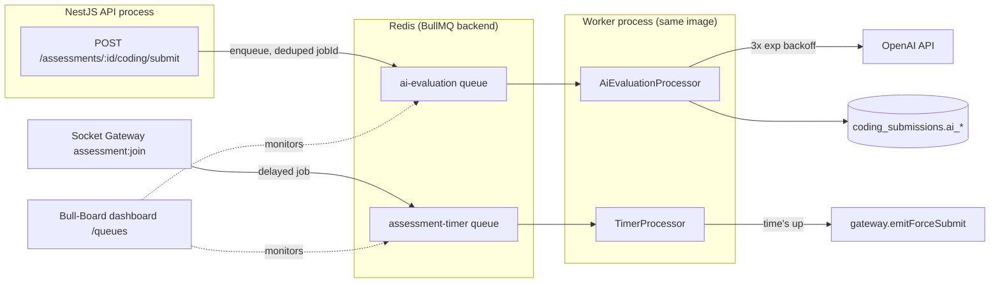
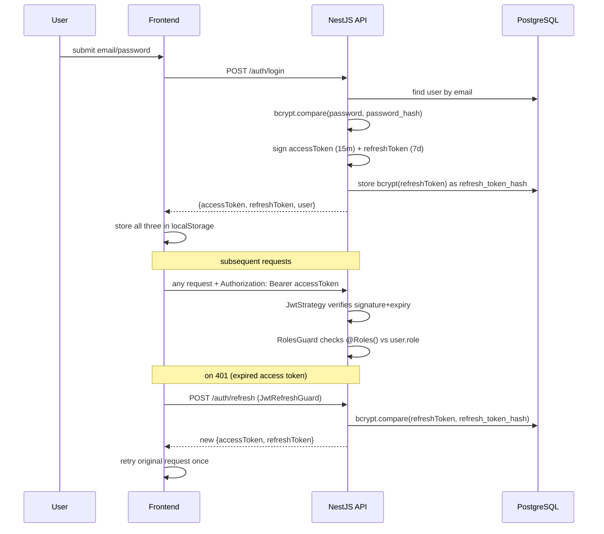
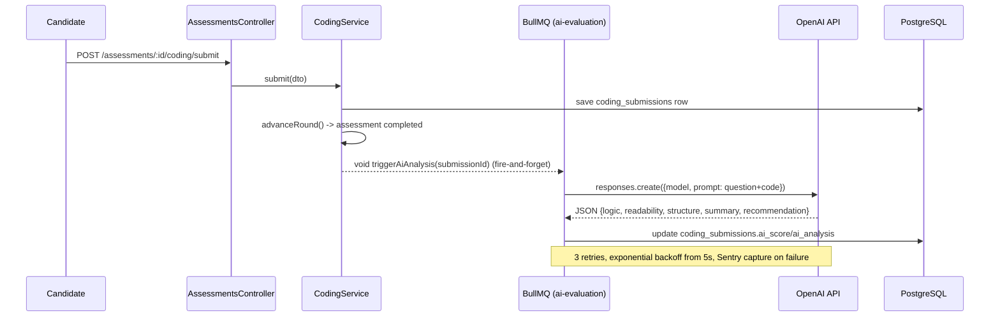
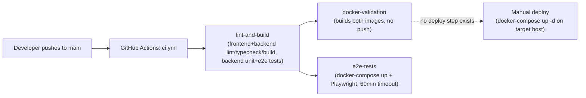

# 03 — System Architecture

## Overview

The platform is a classic three-tier architecture: a React SPA, a NestJS monolith API (plus one worker process for background jobs), and PostgreSQL + Redis for persistence and coordination. There is no microservices split — `backend` and `worker` in `docker-compose.yml` run the **same built image**, just with different start commands (`worker` overrides the command to run the same `dist/main` in a mode where BullMQ processors execute — the "worker" is not a separate codebase).



## Frontend Architecture

- **Framework:** React 19.2.6 + TypeScript 5.9.3, built with Vite 7.3.3.
- **Routing:** TanStack Router 1.100, **file-based** — every file under `src/routes/**` becomes a route automatically via the `@tanstack/router-vite-plugin`, which generates `src/routeTree.gen.ts`. There is no manual route config file to maintain.
- **Data fetching:** TanStack Query 5.100 for all server state (caching, retries, refetch-on-focus). There is **no** Redux/Zustand/global Context for app state — `localStorage` holds the auth token/user, and every page owns its own `useQuery`/`useMutation` calls (a documented duplication problem, see [`13_KNOWN_ISSUES.md`](./13_KNOWN_ISSUES.md)).
- **Styling:** Tailwind CSS v4, CSS-first configuration (no `tailwind.config.js` — theme tokens live in `src/styles.css` under an `@theme inline` block using OKLCH colors). Dark mode toggles a `.dark` class on `<html>` (not persisted across reloads).
- **Component library:** shadcn/ui ("new-york" style) over Radix primitives — 46 files in `src/components/ui/`.
- **Realtime:** `src/lib/socket.ts` wraps `socket.io-client`, connecting to the `/assessment` namespace with the JWT access token passed via `auth.token` in the handshake.
- **Root guard:** `src/routes/__root.tsx` runs a `beforeLoad` check that redirects unauthenticated users away from any `/admin`, `/hr`, `/manager`, `/candidate` route to `/login`, and redirects already-authenticated users away from `/login` to their role's dashboard.

See [`06_FRONTEND.md`](./06_FRONTEND.md) for the full file-by-file breakdown.

## Backend Architecture

- **Framework:** NestJS 11 (modular, decorator-based). 16 feature/infra modules under `dezprox-backend/src/`.
- **ORM:** TypeORM 0.3.29 against PostgreSQL, `SnakeNamingStrategy`, **`synchronize: false` always** — migrations are the only path to schema change.
- **Auth model:** Passport JWT strategies (`jwt`, `jwt-refresh`), guards applied **per-controller** (not globally) via `@UseGuards(JwtAuthGuard, RolesGuard)` + `@Roles(...)`.
- **Global pipeline (`main.ts`):** Helmet (CSP in prod), `ThrottlerGuard` (100 req/min/IP, global), global `ValidationPipe({whitelist, forbidNonWhitelisted, transform})`, `ResponseInterceptor` (wraps every response as `{ data, status: 'success' }`), `MetricsInterceptor`, `ClassSerializerInterceptor`, `SentryGlobalFilter`. No global route prefix (e.g. no `/api/v1`) and no Swagger/OpenAPI setup.
- **Background work:** BullMQ (Redis-backed) — `ai-evaluation` queue (3-attempt exponential backoff, deduped job IDs) and `assessment-timer` queue (delayed jobs that force-submit a round when its timer expires, processed by `TimerProcessor`). A Bull-Board dashboard is mounted at `/queues`.
- **Caching:** `@nestjs/cache-manager` with `cache-manager-ioredis-yet`, applied to all 8 Analytics endpoints (TTL 300–3600s).
- **Observability:** Pino structured logging with explicit secret redaction (`authorization`, `password`, `token`, `refreshToken`), Sentry (errors + profiling), a Prometheus `/metrics` endpoint, and `/health` (Terminus: DB ping, memory heap/RSS thresholds, a placeholder Redis check), `/health/liveness`, `/health/readiness`, `/health/details`.

See [`07_BACKEND.md`](./07_BACKEND.md) for the full module breakdown and [`05_API_REFERENCE.md`](./05_API_REFERENCE.md) for every route.

## Database Architecture

PostgreSQL 15, 12 entities/tables, all relations enforced primarily at the ORM level (several are **not** enforced at the DB level — see [`04_DATABASE.md`](./04_DATABASE.md) for the full list of drift/gaps). Two parallel, unconnected "question" data models exist (`questions` used by the live engine vs. `mcq_questions`/`coding_questions` used by the admin Question Bank UI) — this is the single biggest architectural defect in the system.



> `mcq_questions` and `coding_questions` are drawn separately above because they have **zero relations** to anything else in the schema — they are not connected to `QUESTIONS`, `CODING_SUBMISSIONS`, or `MCQ_ANSWERS`. Full column-level detail is in [`04_DATABASE.md`](./04_DATABASE.md).

## Folder Structure

```
project1/                          # repo root — frontend
├── src/
│   ├── routes/                    # TanStack Router file-based pages (admin/hr/manager/candidate/login/index)
│   ├── components/                # dashboard-layout, coming-soon, error-boundary, stat-card
│   │   └── ui/                    # 46 shadcn/Radix primitives
│   ├── hooks/                     # use-mobile.tsx (unused)
│   ├── lib/                       # api.ts, api-base.ts, auth-user.ts, socket.ts, export-csv.ts, utils.ts
│   ├── types/                     # api.ts (shared TS interfaces)
│   ├── router.tsx                 # TanStack Router bootstrap
│   ├── routeTree.gen.ts           # generated — do not hand-edit
│   └── main.tsx                   # app entry
├── e2e/                            # Playwright specs (mostly test.skip())
├── public/
├── docker-compose.yml
├── Dockerfile                      # frontend (Nginx) image
├── nginx.conf
└── dezprox-backend/                # backend — separate npm project
    └── src/
        ├── auth/                   # JWT strategies, guards, decorators
        ├── users/                  # User entity + service (NO controller — no /users API)
        ├── candidates/
        ├── assessments/            # MCQ/Typing/Coding round services + entities
        ├── question-bank/          # isolated MCQ/Coding question CRUD
        ├── reports/
        ├── ai-evaluation/          # OpenAI integration + BullMQ processor
        ├── analytics/
        ├── gateway/                # Socket.IO gateway + timer processor
        ├── mail/                   # nodemailer service + templates
        ├── redis/                  # ioredis wrapper + Socket.IO Redis adapter
        ├── database/               # TypeORM module, data-source, migrations/
        ├── health/                 # Terminus health checks
        ├── metrics/                # Prometheus + Bull-Board
        ├── common/                 # guards, decorators, enums, constants, helpers
        └── config/                 # jwt.config.ts, database.config.ts
```

## State Management

Frontend: **no global state library.** Server state → TanStack Query. Auth state → `localStorage` (`accessToken`, `refreshToken`, `user`), read via `src/lib/auth-user.ts`. UI state → local `useState` per component. This is a deliberate simplicity choice that works at current scale but means there's no single place to look for "what does the app currently know" beyond each page's own queries.

## API Layer

All frontend↔backend communication goes through a single Axios instance in `src/lib/api.ts`:
- Request interceptor injects `Authorization: Bearer <accessToken>` (skipped for `/auth/login`).
- Response interceptor: on `401`, attempts one silent `/auth/refresh` + retry; on `403`/`500`/network errors, shows a global toast (via `sonner`).
- `unwrapData()` helper strips the backend's `{ data, status: 'success' }` envelope (set by the global `ResponseInterceptor` on the NestJS side).
- Seven API objects: `authApi`, `candidatesApi`, `analyticsApi`, `reportsApi`, `questionBankApi`, `assessmentApi`, `aiEvaluationApi` — full method list in [`06_FRONTEND.md`](./06_FRONTEND.md) and [`05_API_REFERENCE.md`](./05_API_REFERENCE.md).

## Socket Architecture

Single Socket.IO namespace, `/assessment`, guarded by `WsJwtGuard` (verifies the JWT passed in `handshake.auth.token`). Backed by a Redis adapter (`RedisIoAdapter`) so it can scale horizontally across multiple backend instances.



Rooms: `assessmentId` (per-assessment), `candidate:{userId}` (private), `hr-room` (HR/Admin monitoring, joined via `hr:join`).

## Queue Architecture



## Redis Usage

Redis is shared infrastructure for four distinct purposes, all configured from the same `REDIS_HOST/PORT/PASSWORD/DB` env vars:
1. **BullMQ** job queues (`ai-evaluation`, `assessment-timer`).
2. **Socket.IO adapter** (`RedisIoAdapter`) — enables horizontal scaling of the WebSocket gateway.
3. **HTTP response cache** (`cache-manager-ioredis-yet`) — Analytics endpoints, 300–3600s TTL.
4. Direct key/value access via `RedisService` (`src/redis/redis.service.ts`) — thin wrapper (get/set/del/ping) available to any service that needs it.

## Authentication Flow



Full detail in [`08_AUTHENTICATION.md`](./08_AUTHENTICATION.md).

## AI Evaluation Flow



Note: `triggerAiAnalysis` is only invoked from the live coding-submit path. Because assessments are never provisioned today (see [`13_KNOWN_ISSUES.md`](./13_KNOWN_ISSUES.md) Bug #03), this pipeline currently has no real input in production use, despite being fully implemented.

## Deployment Flow



**Important:** despite the workflow being named "CI/CD Pipeline," there is **no deployment/CD stage** anywhere in `.github/workflows/ci.yml`. Deployment today is a manual `docker-compose up -d` on whatever host is targeted. Full detail in [`09_DEPLOYMENT.md`](./09_DEPLOYMENT.md).

## Related Documents

- [`04_DATABASE.md`](./04_DATABASE.md) — full schema, every column, every drift issue
- [`05_API_REFERENCE.md`](./05_API_REFERENCE.md) — all 60 REST routes + WebSocket events
- [`06_FRONTEND.md`](./06_FRONTEND.md) / [`07_BACKEND.md`](./07_BACKEND.md) — implementation detail per side
- [`09_DEPLOYMENT.md`](./09_DEPLOYMENT.md) — Docker, env vars, infra
