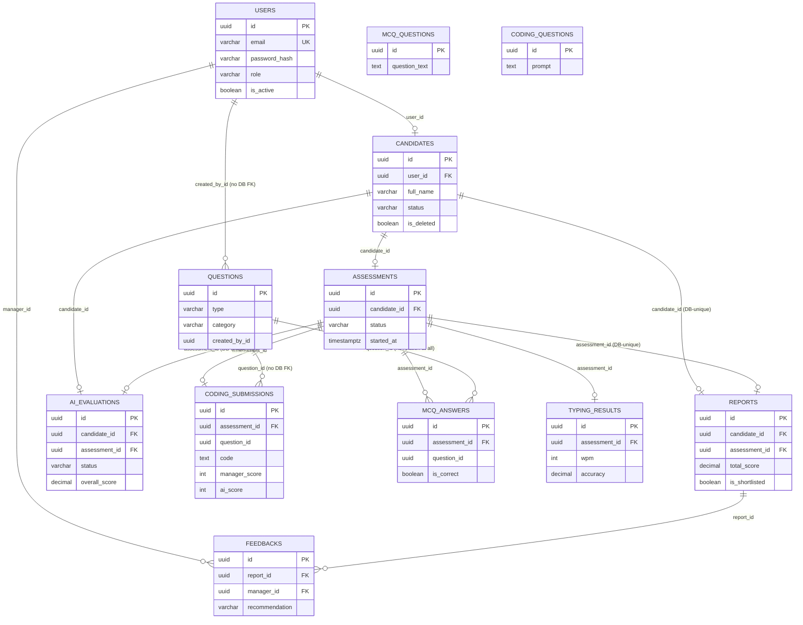

# 04 — Database

PostgreSQL 15, accessed via TypeORM 0.3.29. Naming: `SnakeNamingStrategy` (entities use camelCase properties; the database uses snake_case columns). `synchronize: false` is set everywhere — **migrations are the only legitimate path to schema change.** 12 migrations exist, timestamped `1700000001`–`1700000012`, in `dezprox-backend/src/database/migrations/`.

> ⚠️ **This section documents real drift between the migrations (what actually creates the live table) and the TypeORM entities (what the application code expects).** Where they disagree, both are shown. See [§9 Data Integrity Issues](#9-data-integrity-issues) for the full list — the `feedbacks` table drift in particular is severe enough that it may mean the live table is missing columns the application tries to read/write.

## Table of Contents

1. [users](#1-users)
2. [candidates](#2-candidates)
3. [assessments](#3-assessments)
4. [mcq_answers](#4-mcq_answers)
5. [typing_results](#5-typing_results)
6. [coding_submissions](#6-coding_submissions)
7. [questions](#7-questions)
8. [mcq_questions](#8-mcq_questions-isolated)
9. [coding_questions](#9-coding_questions-isolated)
10. [reports](#10-reports)
11. [feedbacks](#11-feedbacks)
12. [ai_evaluations](#12-ai_evaluations)
13. [question_bank_questions — orphaned, no entity](#13-question_bank_questions--orphaned-dead-table)
14. [ER Diagram](#er-diagram)
15. [Migrations](#migrations-in-order)
16. [Data Integrity Issues](#9-data-integrity-issues)

---

## 1. `users`

Source: `src/users/entities/user.entity.ts`

| Column | Type | Nullable | Unique | Default |
|---|---|---|---|---|
| id | uuid (PK) | No | PK | `gen_random_uuid()` |
| email | varchar(255) | No | Yes | — |
| password_hash | varchar(255) | No | No | — (excluded from serialization) |
| role | varchar(20) CHECK | No | No | `'candidate'` |
| is_active | boolean | No | No | `true` |
| refresh_token_hash | varchar(255) | Yes | No | — (excluded from serialization) |
| created_at | timestamptz | No | No | now() |
| updated_at | timestamptz | No | No | now() |

**Indexes:** `idx_users_email`, `idx_users_role`.
**Relations:** 1–1 → `candidates` (via `candidates.user_id`); 1–M → `feedbacks` (via `feedbacks.manager_id`); 1–M → `questions` (via `questions.created_by_id`, **no DB FK constraint**).
**Purpose:** Every login-capable identity — staff and candidates alike share this table, distinguished by `role`.

---

## 2. `candidates`

Source: `src/candidates/entities/candidate.entity.ts`

| Column | Type | Nullable | Unique | Default |
|---|---|---|---|---|
| id | uuid (PK) | No | PK | generated |
| user_id | uuid (FK → users.id, ON DELETE RESTRICT) | No | Yes | — |
| full_name | varchar(255) | No | No | — |
| phone | varchar(30) | Yes | No | — |
| role_applied | varchar(100) | No | No | — |
| status | varchar(30) CHECK | No | No | `'invited'` |
| notes | text | Yes | No | — |
| is_deleted | boolean | No | No | `false` |
| created_at | timestamptz | No | No | now() |
| updated_at | timestamptz | No | No | now() |

**Indexes:** `idx_candidates_user_id`, `idx_candidates_status`, `idx_candidates_is_deleted`, `idx_candidates_full_name`, plus entity-level `@Index()` on `roleApplied`, `status`, `isDeleted`, `createdAt`.
**Status enum (`CandidateStatus`):** `invited, active, submitted, evaluated, hired, rejected`.
**Relations:** 1–1 → `users`; 1–1 → `assessments` (Assessment owns the FK); 1–1 (DB-unique) → `reports`; 1–1 → `ai_evaluations`.
**Purpose:** The core pipeline record — one row per applicant.

---

## 3. `assessments`

Source: `src/assessments/entities/assessment.entity.ts`

| Column | Type | Nullable | Unique | Default |
|---|---|---|---|---|
| id | uuid (PK) | No | PK | generated |
| candidate_id | uuid (FK → candidates.id, ON DELETE RESTRICT) | No | Yes | — |
| status | varchar(30) CHECK | No | No | `'not_started'` |
| started_at | timestamptz | Yes | No | — |
| round2_started_at | timestamptz | Yes | No | — |
| round3_started_at | timestamptz | Yes | No | — |
| completed_at | timestamptz | Yes | No | — |
| created_at | timestamptz | No | No | now() |

**Status enum (`AssessmentStatus`):** `not_started, round_1, round_2, round_3, completed`.
**Indexes:** `@Index()` on `candidateId`, `status`.
**Relations:** 1–1 → `candidates`; 1–1 → `coding_submissions` (cascade); 1–M → `mcq_answers` (cascade); 1–1 → `typing_results` (cascade); 1–1 (DB-unique) → `reports`; 1–1 (DB-unique) → `ai_evaluations`.
**Purpose:** State machine for a candidate's live 3-round test — this is the row that is supposed to be created when a candidate is invited, and **currently never is** (see [`13_KNOWN_ISSUES.md`](./13_KNOWN_ISSUES.md) Bug #03).

---

## 4. `mcq_answers`

Source: `src/assessments/entities/mcq-answer.entity.ts`

| Column | Type | Nullable | Unique | Default |
|---|---|---|---|---|
| id | uuid (PK) | No | PK | generated |
| assessment_id | uuid (FK → assessments.id, ON DELETE CASCADE) | No | No | — |
| question_id | uuid (**no FK constraint, no ORM relation**) | No | No | — |
| topic | varchar(100) | No | No | — |
| selected_option | varchar(255) | No | No | — |
| is_correct | boolean | No | No | `false` |
| answered_at | timestamptz | No | No | now() |

**Constraint:** composite `UNIQUE(assessment_id, question_id)` (migration-level; not decorated in the entity).
**Purpose:** One row per MCQ question a candidate answered, with correctness pre-computed server-side.
**Known gap:** `question_id` is a plain UUID with no relation or FK at either the ORM or database level — it is presumably meant to reference `questions.id` but was never wired up.

---

## 5. `typing_results`

Source: `src/assessments/entities/typing-result.entity.ts`

| Column | Type | Nullable | Unique | Default |
|---|---|---|---|---|
| id | uuid (PK) | No | PK | generated |
| assessment_id | uuid (FK → assessments.id, ON DELETE CASCADE) | No | Yes | — |
| passage | text | Yes | No | — |
| typed_text | text | Yes | No | — |
| time_taken_seconds | int | No | No | 0 (migration) |
| wpm | int | No | No | 0 (migration) |
| accuracy | decimal(5,2) | No | No | 0 (migration) |
| mistakes | int | No | No | `0` |
| word_count | int | No | No | 0 — **orphaned column, no entity field maps to it** |
| created_at | timestamptz | No | No | now() |

**Purpose:** One row per candidate per assessment holding their typing-round performance.

---

## 6. `coding_submissions`

Source: `src/assessments/entities/coding-submission.entity.ts`

| Column | Type | Nullable | Unique | Default |
|---|---|---|---|---|
| id | uuid (PK) | No | PK | generated |
| assessment_id | uuid (FK → assessments.id, ON DELETE CASCADE) | No | Yes | — |
| question_id | uuid (**entity has `@ManyToOne`, but migration adds the column with no FK constraint**) | No | No | — |
| code | text | No | No | `''` |
| language | enum CHECK | No | No | `typescript` |
| time_taken_seconds | int | No | No | 0 |
| draft_code | text | Yes | No | — |
| manager_score | int (CHECK 0–100 at migration level) | Yes | No | — |
| manager_feedback | text | Yes | No | — |
| manager_reviewed_at | timestamp | Yes | No | — |
| ai_score | int | Yes | No | — |
| ai_analysis | json | Yes | No | — |
| ai_analysed_at | timestamp | Yes | No | — |
| submitted_at | timestamp | Yes | No | — |
| created_at | timestamptz | No | No | now() |
| updated_at | timestamptz | No | No | now() |

**Language enum (`ProgrammingLanguage`):** entity/enum defines `javascript, typescript, python, java, cpp`. The migration's CHECK constraint additionally allows `csharp` — **a value unreachable from application code**, since the TypeScript enum doesn't include it.
**Purpose:** The candidate's final coding-round submission, plus both human and AI scoring.

---

## 7. `questions`

Source: `src/assessments/entities/question.entity.ts`

| Column | Type | Nullable | Unique | Default |
|---|---|---|---|---|
| id | uuid (PK) | No | PK | generated |
| type | enum (`mcq`, `coding`) | No | No | — |
| category | varchar(100) | No | No | — |
| difficulty | enum (`easy`,`medium`,`hard`, locally defined `QuestionDifficulty`) | No | No | — |
| text | text | No | No | — |
| options | json (string[]) | Yes | No | — |
| correct_answer | varchar (excluded from serialization) | Yes | No | — |
| code_starter | text | Yes | No | — |
| is_active | boolean | No | No | `true` |
| created_by_id | uuid (**entity `@ManyToOne` to users, but migration adds no `REFERENCES` clause**) | No | No | — |
| created_at | timestamptz | No | No | now() |
| updated_at | timestamptz | No | No | now() |

**Purpose:** This is the table the **live assessment engine actually reads from** (`McqService.getQuestions`, `CodingService.getQuestion` both query this table, filtered by `category` = candidate's `roleApplied`). It is populated only by whatever seed data exists — the admin-facing Question Bank UI writes to a completely different pair of tables (`mcq_questions`/`coding_questions`, below), which this table has **no relation to**.

---

## 8. `mcq_questions` (isolated)

Source: `src/question-bank/entities/mcq-question.entity.ts`

| Column | Type | Nullable | Unique | Default |
|---|---|---|---|---|
| id | uuid (PK) | No | PK | generated |
| question_text | text | No | No | — |
| options | text[] | No | No | — |
| correct_answer | text (excluded) | No | No | — |
| topic | varchar | No | No | — |
| role_applied | varchar | No | No | — |
| difficulty | enum (`Difficulty`: easy/medium/hard — a **separate, duplicate** enum from `QuestionDifficulty` above) | No | No | `medium` |
| status | enum (`active`,`inactive`) | No | No | `active` |
| is_deleted | boolean | No | No | `false` |
| created_at / updated_at | timestamptz | No | No | now() |

**Relations: none.** Written to by the admin Question Bank UI (`/question-bank/mcq/*` endpoints). Never read by the live assessment engine.

## 9. `coding_questions` (isolated)

Source: `src/question-bank/entities/coding-question.entity.ts`

| Column | Type | Nullable | Unique | Default |
|---|---|---|---|---|
| id | uuid (PK) | No | PK | generated |
| prompt | text | No | No | — |
| language | enum (`ProgrammingLanguage`) | No | No | — |
| difficulty | enum (`Difficulty`) | No | No | `medium` |
| status | enum | No | No | `active` |
| is_deleted | boolean | No | No | `false` |
| created_at / updated_at | timestamptz | No | No | now() |

**Relations: none.** Same disconnect as `mcq_questions` — see [`02_FEATURES.md` §3](./02_FEATURES.md#3-question-bank) for the product impact.

---

## 10. `reports`

Source: `src/reports/entities/report.entity.ts`

| Column | Type | Nullable | Unique | Default |
|---|---|---|---|---|
| id | uuid (PK) | No | PK | generated |
| candidate_id | uuid (FK → candidates.id, ON DELETE RESTRICT) | No | Yes | — |
| assessment_id | uuid (FK → assessments.id, ON DELETE RESTRICT) | No | Yes | — |
| mcq_percentage | decimal(5,2) | No | No | 0 |
| mcq_correct | int | No | No | 0 |
| mcq_total | int | No | No | 0 |
| mcq_topic_breakdown | jsonb | No | No | `{}` |
| typing_wpm | int | No | No | 0 |
| typing_accuracy | decimal(5,2) | No | No | 0 |
| coding_manager_score | decimal(5,2) | Yes | No | — |
| coding_ai_score | decimal(5,2) | Yes | No | — |
| total_score | decimal(5,2) | No | No | 0 |
| is_result_released | boolean | No | No | `false` |
| is_shortlisted | boolean | No | No | `false` |
| recommendation | varchar(10) (`hire`/`reject`/`hold`) | Yes | No | — |
| notes | text | Yes | No | — |
| generated_at | timestamptz | No | No | now() |

**Indexes:** `@Index()` on `candidateId`, `assessmentId`, `totalScore`, `isShortlisted`, `generatedAt`.
**Relations:** M–1 → `candidates` (DB-enforced unique, functionally 1–1); M–1 → `assessments` (same); 1–M → `feedbacks`.
**Purpose:** The single aggregated view of a candidate's performance used for hiring decisions.

---

## 11. `feedbacks`

Source: `src/reports/entities/feedback.entity.ts`

⚠️ **Severe migration/entity drift — read this table's section carefully before writing code against it.**

**What migration `1700000008-CreateFeedbacks.ts` actually creates:**

| Column | Type | Nullable |
|---|---|---|
| id | uuid (PK) | No |
| report_id | uuid (FK → reports.id, ON DELETE CASCADE) | No |
| manager_id | uuid (FK → users.id, ON DELETE RESTRICT) | No |
| comment | text | **No (NOT NULL)** |
| recommendation | varchar CHECK | No |
| created_at / updated_at | timestamptz | No |

Plus a composite `UNIQUE(report_id, manager_id)` constraint.

**What the current `Feedback` entity (application code) expects to read/write:**

| Column | Type | Nullable |
|---|---|---|
| id | uuid (PK) | No |
| report_id | uuid | No |
| manager_id | uuid | No |
| overall_rating | int (1–5, no DB CHECK) | No |
| technical_comment | text | Yes |
| communication_comment | text | Yes |
| recommendation | enum | No |
| created_at / updated_at | timestamptz | No |

**The gap:** `overall_rating`, `technical_comment`, and `communication_comment` were **never added by any migration**. If migrations are the only source of schema truth (they are — `synchronize: false`), the live `feedbacks` table is missing three columns the application reads/writes, and still has a `comment NOT NULL` column the application never populates. **This will cause runtime errors (`column does not exist` / NOT NULL violations) the first time `POST /reports/:id/feedback` is exercised against a database built purely from migrations.** This is the highest-priority database fix — see [`13_KNOWN_ISSUES.md`](./13_KNOWN_ISSUES.md) and [`16_HANDOVER_GUIDE.md`](./16_HANDOVER_GUIDE.md).

**Action required:** write a new migration (`1700000013-...`) that adds `overall_rating`, `technical_comment`, `communication_comment` and either drops `comment` or backfills it, before this feature is exercised in any real environment.

---

## 12. `ai_evaluations`

Source: `src/ai-evaluation/entities/ai-evaluation.entity.ts`

| Column | Type | Nullable | Unique | Default |
|---|---|---|---|---|
| id | uuid (PK) | No | PK | generated |
| candidate_id | uuid (FK → candidates.id, ON DELETE RESTRICT) | No | Yes | — |
| assessment_id | uuid (FK → assessments.id, ON DELETE RESTRICT) | No | Yes | — |
| status | enum (`pending`,`running`,`completed`,`failed`) | No | No | `pending` |
| strengths | text[] | Yes | No | — |
| weaknesses | text[] | Yes | No | — |
| coding_analysis | jsonb | Yes | No | — |
| communication_analysis | jsonb | Yes | No | — |
| summary | text | Yes | No | — |
| recommendation | enum | Yes | No | — |
| overall_score | decimal(5,2) | Yes | No | — |
| raw_response | text | Yes | No | — (never exposed to clients) |
| error_message | text | Yes | No | — (never exposed to clients) |
| last_evaluated_at | timestamp | Yes | No | — |
| created_at / updated_at | timestamptz | No | No | now() |

**Purpose:** Stores the async AI evaluation result per candidate/assessment. Migration `1700000011-FixAiEvaluations.ts` reshaped this table significantly after the fact (dropped `skill_scores`, converted `strengths`/`weaknesses` from jsonb to text[], added most of the columns above) — its `down()` is a **partial rollback** that does not fully restore the original shape (documented in the migration's own comment).

---

## 13. `question_bank_questions` — orphaned, dead table

Created by migration `1700000010-CreateQuestionBank.ts` (type, topic, difficulty, question_text, options, correct_answer, coding_prompt, role_tag, is_active + timestamps + 5 indexes). **No `*.entity.ts` file anywhere in the codebase maps to this table.** It was superseded by the separate `mcq_questions`/`coding_questions`/`questions` tables added later in migration 12, but was never dropped. If migrations are run in full, this table exists in the live database and is entirely unused by application code — safe to drop once confirmed with the team, but do so via a proper migration, not a manual `DROP TABLE`.

---

## ER Diagram

`MCQ_QUESTIONS` and `CODING_QUESTIONS` are drawn without connecting lines deliberately — they have no relations to any other table.

## Migrations (in order)

| # | File | What it does | Reversible? |
|---|---|---|---|
| 1 | `1700000001-CreateUsers.ts` | Creates `users` + email/role indexes | ✅ |
| 2 | `1700000002-CreateCandidates.ts` | Creates `candidates`, FK to `users` (RESTRICT) | ✅ |
| 3 | `1700000003-CreateAssessments.ts` | Creates `assessments`, FK to `candidates` (RESTRICT) | ✅ |
| 4 | `1700000004-CreateMcqAnswers.ts` | Creates `mcq_answers`, FK to `assessments` (CASCADE), no FK on `question_id` | ✅ |
| 5 | `1700000005-CreateTypingResults.ts` | Creates `typing_results` incl. orphaned `word_count` | ✅ |
| 6 | `1700000006-CreateCodingSubmissions.ts` | Creates `coding_submissions`, language CHECK includes unreachable `csharp` | ✅ |
| 7 | `1700000007-CreateReports.ts` | Creates `reports`, unique FKs to `candidates`/`assessments` | ✅ |
| 8 | `1700000008-CreateFeedbacks.ts` | Creates `feedbacks` with `comment`/`recommendation` shape — **now stale vs. entity** | ✅ |
| 9 | `1700000009-CreateAiEvaluations.ts` | Creates `ai_evaluations` (pre-fix shape) | ✅ |
| 10 | `1700000010-CreateQuestionBank.ts` | Creates `question_bank_questions` — **now orphaned, no entity** | ✅ |
| 11 | `1700000011-FixAiEvaluations.ts` | Reshapes `ai_evaluations` to current entity shape | ⚠️ Partial — `down()` doesn't fully restore original shape |
| 12 | `1700000012-FixEverythingElse.ts` | Renames/adds columns on `coding_submissions`/`typing_results`; creates `mcq_questions`, `coding_questions`, `questions` (no FK on `questions.created_by_id`) | ❌ **`down()` is completely empty — fully irreversible** |

Run via `npm run migration:run` (backend `package.json`, wraps `scripts/run-migrations.cjs`). Generate new migrations via `npm run migration:gen` — **note:** the CLI `DataSource` (`src/database/data-source.ts`) does **not** set `SnakeNamingStrategy`, while the runtime `DatabaseModule` does. This is latent config drift: a newly generated migration could compute different column names than the running app expects for any entity relying on implicit naming rather than explicit `name:` overrides. Verify generated SQL manually before applying.

## Config Reference

| File | Purpose |
|---|---|
| `src/database/database.module.ts` | Runtime TypeORM config — reads from `ConfigService` (`database.*` namespace), sets `SnakeNamingStrategy`, `synchronize: false` always, auto-discovers entities via glob |
| `src/database/data-source.ts` | CLI-only `DataSource` for `migration:generate`/`migration:revert` — reads `DB_*` env vars directly, **no naming strategy set** |
| `src/config/database.config.ts` | `registerAs('database', ...)` — supports either discrete `DB_HOST/PORT/USER/PASS/NAME/SSL` vars or a single `DATABASE_URL`/`DATABASE_PUBLIC_URL` connection string (Railway-style), auto-derives `DB_SSL` |

## 9. Data Integrity Issues

Ranked by severity — fix these before relying on the affected feature in any real environment.

| Severity | Issue | Table(s) | Impact |
|---|---|---|---|
| 🔴 Critical | `feedbacks` migration/entity drift | `feedbacks` | `POST /reports/:id/feedback` will likely fail against a migration-built DB — missing columns / NOT NULL violation on unused `comment` |
| 🔴 Critical | Two disconnected question systems | `questions` vs `mcq_questions`/`coding_questions` | Admin-authored questions can never reach a candidate (see [`02_FEATURES.md`](./02_FEATURES.md)) |
| 🟠 High | `mcq_answers.question_id` has no relation or FK | `mcq_answers` | No referential integrity; orphaned answers possible if a question is deleted |
| 🟠 High | `coding_submissions.question_id` / `questions.created_by_id` have ORM relations but no DB FK constraint | `coding_submissions`, `questions` | Referential integrity relies entirely on application code, not the database |
| 🟡 Medium | Migration `1700000012` has an empty, irreversible `down()` | schema-wide | Cannot cleanly roll back this migration in any environment |
| 🟡 Medium | `1700000011`'s `down()` is a partial rollback | `ai_evaluations` | Rolling back leaves the table in neither the old nor new shape |
| 🟢 Low | `typing_results.word_count` orphaned column | `typing_results` | Dead column, harmless but confusing |
| 🟢 Low | `coding_submissions` language CHECK allows `csharp`, unreachable from the enum | `coding_submissions` | DB is more permissive than application code — not currently exploitable, just inconsistent |
| 🟢 Low | Duplicate `QuestionDifficulty`/`Difficulty` enums with identical values | `questions` vs `mcq_questions`/`coding_questions` | Symptom of the two-question-system split, not a bug on its own |
| 🟢 Low | `question_bank_questions` orphaned dead table | — | No entity reads/writes it; safe to drop via migration after confirming with the team |
| 🟢 Low | CLI `data-source.ts` missing `SnakeNamingStrategy` | schema-wide (future migrations) | Verify any `migration:generate` output manually before applying |

## Related Documents

- [`02_FEATURES.md`](./02_FEATURES.md) — product impact of the Question Bank disconnect
- [`13_KNOWN_ISSUES.md`](./13_KNOWN_ISSUES.md) — full bug registry including these DB issues
- [`09_DEPLOYMENT.md`](./09_DEPLOYMENT.md) — running migrations in each environment
