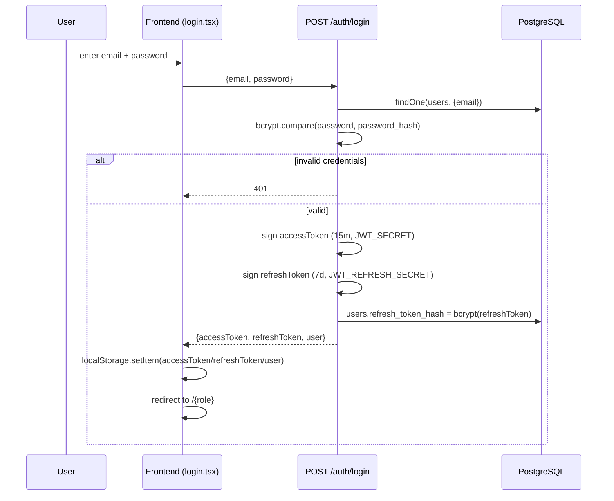
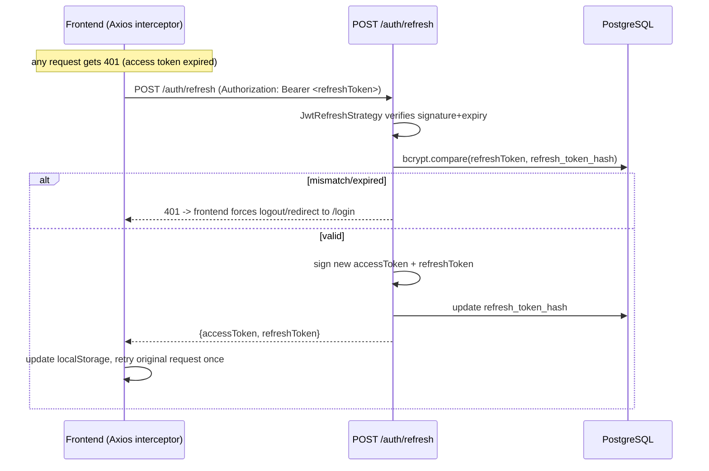

# 08 — Authentication

## Overview

Stateless JWT authentication with a refresh-token rotation scheme, backed by Passport strategies on the NestJS side. Four roles, no self-registration — every account (staff or candidate) is created by an Admin/HR user or an internal dev seed.

## Token Model

| Token | Lifetime | Signed with | Where stored (client) | Where stored (server) |
|---|---|---|---|---|
| Access token | 15 minutes (`JWT_EXPIRES_IN`) | `JWT_SECRET` | `localStorage["accessToken"]` | not stored (stateless) |
| Refresh token | 7 days (`JWT_REFRESH_EXPIRES_IN`) | `JWT_REFRESH_SECRET` | `localStorage["refreshToken"]` | `users.refresh_token_hash` (bcrypt hash) |

Both secrets are **required** env vars — `jwt.config.ts` throws at startup if either is missing. No hardcoded fallback secret exists anywhere in the codebase (verified).

## Roles & RBAC

`Role` enum (`src/common/enums/role.enum.ts`): `ADMIN`, `MANAGER`, `HR`, `CANDIDATE`.

Permission groups (`src/common/constants/permissions.constant.ts`), used as shorthand in `@Roles(...)` decorators:

| Group | Roles |
|---|---|
| `ADMIN_ONLY` | ADMIN |
| `ADMIN_HR` | ADMIN, HR |
| `ADMIN_MANAGER` | ADMIN, MANAGER |
| `ADMIN_HR_MANAGER` | ADMIN, HR, MANAGER |
| `ALL_STAFF` | ADMIN, HR, MANAGER |
| `ALL_ROLES` | ADMIN, HR, MANAGER, CANDIDATE |

Enforcement: `RolesGuard` reads `@Roles(...)` metadata and compares against `request.user.role` (populated by `JwtStrategy` from the token payload). Applied consistently: every controller inspected has `@UseGuards(JwtAuthGuard, RolesGuard)` — but this is **opt-in per controller**, not registered globally via `APP_GUARD`. Every existing controller does it correctly; there is no safety net if a future controller is added without the decorator.

## Login Process

`AuthController` has no class-level guard — `POST /auth/login` is decorated `@Public()` explicitly.

## Logout Process

`POST /auth/logout` (requires `JwtAuthGuard`) clears `users.refresh_token_hash` server-side, invalidating any future refresh attempt with the old refresh token. The frontend also clears `localStorage` on logout. **204 No Content**.

## Token Refresh Flow

The refresh endpoint reads the refresh token from the `Authorization` header via the `jwt-refresh` Passport strategy — **not** from a request body (the `RefreshTokenDto` class exists in the codebase but is unused/dead).

## Ownership Checks

Beyond role gating, several endpoints enforce **row-level ownership** — e.g. a CANDIDATE calling `GET /candidates/:id` can only succeed if `:id` resolves to their own candidate record. This is implemented via `assertOwnership(userId, resourceOwnerId, role)` (`common/helpers/ownership.helper.ts`), which allows staff roles to bypass the check while candidates are restricted to their own resources. Used in `CandidatesService`, `AssessmentsService.getAssessmentForUser`, etc.

## WebSocket Authentication

`WsJwtGuard` (`common/guards/ws-jwt.guard.ts`) performs the same JWT verification on every Socket.IO connection/message, reading the token from `handshake.auth.token` (passed explicitly by `src/lib/socket.ts` on connect) rather than an HTTP header. Invalid/missing tokens throw `WsException('Unauthorized')`.

## Password Handling

- Hashing: bcrypt, **cost factor 10**, applied consistently in `users.service.ts`, `candidates.service.ts` (candidate account creation), `auth.service.ts` (refresh-token hashing).
- Candidate accounts are created with an auto-generated temporary password, emailed in plaintext via the invite email (`mail.service.ts`). **There is no forced-password-change-on-first-login flag** on the `User` entity — a real gap for a system that emails plaintext temp passwords.

## Dev-Mode Conveniences

`login.tsx` shows one-click demo-login buttons, gated behind `import.meta.env.DEV` — these do not exist in a production build. Backend: `SEED_DEV_LOGIN_USERS` env var (default: auto-true outside `production`/`staging`) seeds demo staff accounts when the `users` table is empty (`users.service.ts`).

## Security Assessment

| Control | Status | Risk |
|---|---|---|
| JWT secrets required from env, no fallback | ✅ Good | Low |
| Refresh token hashed (bcrypt) server-side | ✅ Good | Low |
| Refresh token returned in JSON body → likely `localStorage` | ⚠️ | **Medium — exposed to any future XSS.** Consider httpOnly secure cookies. |
| `JwtAuthGuard` opt-in per controller, not global | ⚠️ | **Medium — no safety net for a future controller.** Consider `APP_GUARD` registration with explicit `@Public()` opt-outs. |
| `JwtStrategy` doesn't re-check DB user state on every request | ⚠️ | A disabled user (`is_active = false`) stays valid for up to 15 minutes (until access token expiry) |
| Rate limiting | ⚠️ | Global 100/min/IP applies to `/auth/login` too — no stricter login-specific throttle |
| RBAC (`RolesGuard` + `@Roles()`) | ✅ Good | Applied consistently, no unguarded sensitive endpoint found |
| No forgot-password / reset flow | ❌ Missing | Operational gap, not a vulnerability per se |
| No email verification | ❌ Missing | Acceptable given invite-only model, but worth a conscious decision |
| No forced password change after temp-password login | ❌ Missing | Plaintext temp passwords persist indefinitely if the candidate never changes them |
| bcrypt cost factor 10 | ⚠️ Low | 12 is more current best practice |

## Recommendations (Priority Order)

1. Add a forgot-password flow before any real launch.
2. Move refresh tokens to httpOnly secure cookies, or consciously document the localStorage/XSS tradeoff as accepted risk.
3. Register `JwtAuthGuard` globally via `APP_GUARD` with explicit `@Public()` opt-outs, so new controllers are secure-by-default.
4. Add a stricter throttle specifically on `/auth/login` and `/auth/refresh`.
5. Add a `mustChangePassword` flag to `User`, set on invite-created accounts, enforced on first login.
6. Bump bcrypt cost factor from 10 to 12.

## Related Documents

- [`05_API_REFERENCE.md` §1 Auth](./05_API_REFERENCE.md#1-auth--auth-authcontroller) — exact request/response shapes
- [`07_BACKEND.md` §Guards](./07_BACKEND.md#guards) — guard implementation detail
- [`13_KNOWN_ISSUES.md`](./13_KNOWN_ISSUES.md) — auth-related bugs and gaps tracked with priority
