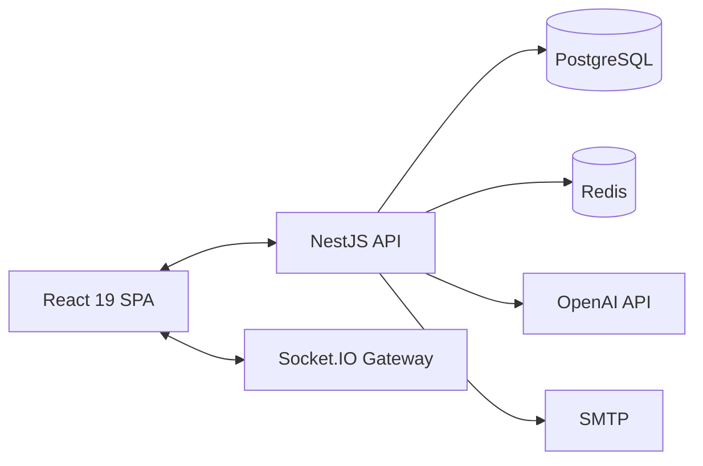

# Dezprox Hiring Platform

> Internal recruitment and technical-assessment platform for Dezprox. **Not** a public ATS — invite-only, used by Dezprox staff (Admin, HR, Manager) and invited candidates only.

[](../.github/workflows/ci.yml)
[](./11_CURRENT_STATUS.md)
[](#license)

## Overview

Dezprox Hiring Platform combines candidate pipeline tracking, a live 3-round technical assessment (MCQ → Typing → Coding), and an AI-assisted evaluation/reporting layer into one internal tool. Full product context: [`01_PROJECT_OVERVIEW.md`](./01_PROJECT_OVERVIEW.md).

> ⚠️ **Current status:** ~58% complete. The core candidate assessment flow is not yet functional end to end — see [`11_CURRENT_STATUS.md`](./11_CURRENT_STATUS.md) and [`16_HANDOVER_GUIDE.md`](./16_HANDOVER_GUIDE.md) before assuming this is production-ready.

## Screenshots

> _Placeholder — add screenshots of the Admin dashboard, Candidate assessment screen, and Manager review page here once available._

| Admin Dashboard | Candidate Assessment | Manager Review |
|---|---|---|
| _screenshot placeholder_ | _screenshot placeholder_ | _screenshot placeholder_ |

## Architecture



Full architecture with every diagram: [`03_SYSTEM_ARCHITECTURE.md`](./03_SYSTEM_ARCHITECTURE.md).

## Tech Stack

**Frontend:** React 19, TypeScript, Vite, TanStack Router (file-based) + TanStack Query, Tailwind CSS v4, shadcn/ui, Monaco Editor, Socket.IO client, Recharts, React Hook Form + Zod, Sentry.

**Backend:** NestJS 11, TypeORM 0.3 + PostgreSQL 15, Redis 7 (BullMQ queues, Socket.IO adapter, response cache), Passport JWT, bcrypt, Helmet, Pino, Sentry, Prometheus, OpenAI SDK, nodemailer.

**Infra:** Docker + Docker Compose, Nginx, GitHub Actions CI.

Full detail: [`06_FRONTEND.md`](./06_FRONTEND.md), [`07_BACKEND.md`](./07_BACKEND.md).

## Features

| Feature | Status |
|---|---|
| Authentication (JWT, RBAC, 4 roles) | 🟢 90% |
| Candidate Management | 🟢 80% |
| Question Bank | 🟡 55% (disconnected from live engine) |
| Assessment Builder | 🔴 15% |
| MCQ / Typing Rounds | 🔴 20% (broken) |
| Coding Round | 🟡 45% |
| Reports | 🟢 75% |
| Analytics | 🟡 55% |
| AI Evaluation | 🟡 40% (built, currently unreachable) |
| Settings | 🔴 10% |
| Notifications | 🔴 20% |

Full feature-by-feature breakdown: [`02_FEATURES.md`](./02_FEATURES.md).

## Folder Structure

```
project1/                     # frontend (repo root)
├── src/
│   ├── routes/                # pages (file-based routing, by role)
│   ├── components/             # app components + ui/ (shadcn)
│   ├── lib/                     # api client, socket, auth, utils
│   └── hooks/, types/
├── e2e/                          # Playwright specs
├── docs/                          # <- you are here
├── docker-compose.yml
└── dezprox-backend/                # backend (separate npm project)
    └── src/
        ├── auth/, users/, candidates/, assessments/
        ├── question-bank/, reports/, ai-evaluation/, analytics/
        ├── gateway/, mail/, redis/, database/, health/, metrics/
        └── common/, config/
```

Full explanation: [`03_SYSTEM_ARCHITECTURE.md` §Folder Structure](./03_SYSTEM_ARCHITECTURE.md#folder-structure).

## Getting Started

```bash
git clone <repository-url>
cd "project1"

# Backend
cd dezprox-backend
npm install
cp .env.example .env   # set JWT_SECRET, JWT_REFRESH_SECRET, DB_*, REDIS_* at minimum
docker-compose up -d postgres redis   # from repo root, in another terminal
npm run migration:run
npm run start:dev

# Frontend (new terminal, repo root)
npm install
cp .env.example .env
npm run dev
```

Full setup guide including debugging, testing, and Docker deployment: [`10_DEVELOPER_SETUP.md`](./10_DEVELOPER_SETUP.md) and [`09_DEPLOYMENT.md`](./09_DEPLOYMENT.md).

## Installation (Docker Compose — Production-Style)

```bash
cp dezprox-backend/.env.example dezprox-backend/.env   # fill in real secrets
cp .env.production.example .env
docker-compose up --build -d
docker-compose exec backend npm run migration:run
```

## Documentation Index

| Doc | Contents |
|---|---|
| [`01_PROJECT_OVERVIEW.md`](./01_PROJECT_OVERVIEW.md) | What/why, roadmap, architecture diagram |
| [`02_FEATURES.md`](./02_FEATURES.md) | Every feature in detail |
| [`03_SYSTEM_ARCHITECTURE.md`](./03_SYSTEM_ARCHITECTURE.md) | Full architecture + mermaid diagrams |
| [`04_DATABASE.md`](./04_DATABASE.md) | Every table, ER diagram, integrity issues |
| [`05_API_REFERENCE.md`](./05_API_REFERENCE.md) | All 60 REST routes + WebSocket events |
| [`06_FRONTEND.md`](./06_FRONTEND.md) | Pages, components, hooks, API client |
| [`07_BACKEND.md`](./07_BACKEND.md) | Modules, services, guards, queues |
| [`08_AUTHENTICATION.md`](./08_AUTHENTICATION.md) | JWT, RBAC, full auth flow |
| [`09_DEPLOYMENT.md`](./09_DEPLOYMENT.md) | Env vars, Docker, CI/CD |
| [`10_DEVELOPER_SETUP.md`](./10_DEVELOPER_SETUP.md) | Local dev setup |
| [`11_CURRENT_STATUS.md`](./11_CURRENT_STATUS.md) | Module-by-module completion % |
| [`12_ROADMAP.md`](./12_ROADMAP.md) | 4-sprint plan to MVP |
| [`13_KNOWN_ISSUES.md`](./13_KNOWN_ISSUES.md) | Every bug, with file:line references |
| [`14_CODING_GUIDELINES.md`](./14_CODING_GUIDELINES.md) | Conventions for new code |
| [`15_CHANGELOG.md`](./15_CHANGELOG.md) | Version history |
| [`16_HANDOVER_GUIDE.md`](./16_HANDOVER_GUIDE.md) | **Start here if you're new** |
| [`FINAL_PROJECT_SUMMARY.md`](./FINAL_PROJECT_SUMMARY.md) | Executive summary |

## Roadmap

1. **Sprint 1 (current):** unblock the core assessment flow (see [`16_HANDOVER_GUIDE.md`](./16_HANDOVER_GUIDE.md))
2. **Sprint 2:** complete the assessment experience
3. **Sprint 3:** Admin/HR/Manager completeness
4. **Sprint 4:** production hardening

Full detail: [`12_ROADMAP.md`](./12_ROADMAP.md).

## Contributing

This is an internal Dezprox project — not open to external contributions. For internal contributors: read [`14_CODING_GUIDELINES.md`](./14_CODING_GUIDELINES.md) before opening a PR, and check [`13_KNOWN_ISSUES.md`](./13_KNOWN_ISSUES.md) to avoid duplicating a known bug fix already in progress.

## License

Internal / proprietary — Dezprox. Not licensed for external distribution or reuse.
